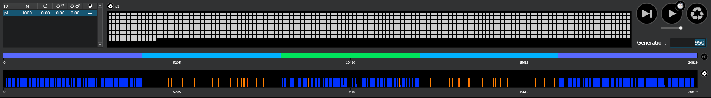
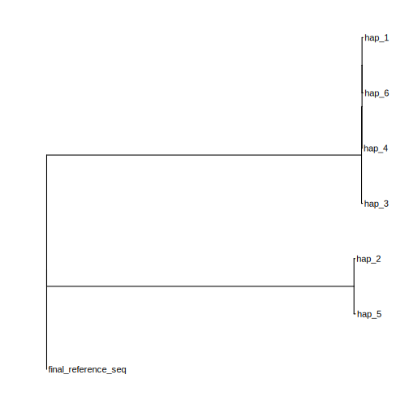
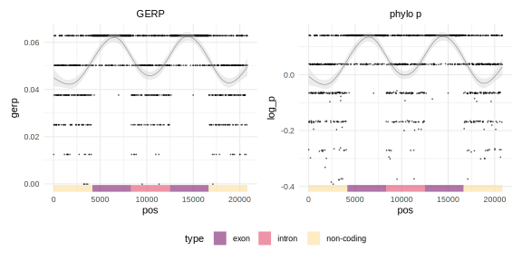

# Simulate GERP Input with SLiM

This is a small test to simulate data for the `msa_pipeline` with `SLiM3`.

The basic steps are collected in `create_dummy.sh`, a config file for the `msa_pipeline` is provided in `config_dummy.yaml`:


## Pieces

- [msa pipeline](https://bitbucket.org/bucklerlab/msa_pipeline/src/master/)
- [SLiM3](https://github.com/MesserLab/SLiM)

## Creating the input data

Creating folder structure expected by `R`, `SLiM3` and `RAxML`

```sh
mkdir -p data results alignment
```

Creating random reference sequence

```sh
Rscript --vanilla R/create_dummy_ref.R

```
Using `SliM3` to simulate some diverged haplotypes based on the reference sequence:

```sh
slim -s 42 sequence_vcf_output.slim
```



Fold and align the haplotypes (we are not really aligning here - just pasting them one below the other)

```
for k in $(ls results/*.fa); do 
 fold -w 80 ${k} > ${k%.fa}_f.fa
 sleep .1
 rm ${k}
 cat ${k%.fa}_f.fa >> alignment/alignment.fa
 sleep .1;
done
```

Create the phylogeny for the selected samples using `raxml-ng`

```sh
raxml-ng \
  --msa alignment/alignment.fa \
  --msa-format FASTA \
  --seed 42 \
  --model JC+G 
```

Quick visualization of the phylogenetic tree

```sh
# creating random reference sequence
Rscript --vanilla R/plot_phylo.R
```



At this point the simulated data is ready to be plugged into the `msa_pipeline`:

Copy the `results/final_hap*.fa` and `results/ref_sim_f.fa` files into the `data/` folder of the `msa_pipeline`.

Then copy the `config_dummy.yaml` into the `config/` folder of the `msa_pipeline`.
The information for `speciesTree: ` was gathered from the `raxml-ng` results in `alignment.fa.raxml.bestTree`. Note, that the names in the tree had to be adjusted to match the name of the `.fasta` files (instead of the sequence headers - eg.  `final_hap_1_f` instead of `hap_1`).


Within the `msa_pipeline`, the GERP scores can then be called by invoking

```sh
snakemake --use-conda -j 5 --configfile config/config_dummy.yaml -R align
snakemake --use-conda -j 1 --configfile config/config_dummy.yaml -R roast
snakemake --use-conda -j 5 --configfile config/config_dummy.yaml -R call_conservation
```

(This should run very quick - <1 min on a standard laptop).

After the `msa_pipeline` has completed, the files `final_reference_seq.gerp.final.bed` and `final_reference_seq.phylop.final.bed` and be copyd from the folders `results/gerp/` and `results/phylop/` of the `msa_pipeline` into the folder `gerp/`.

Then, the results can be plotted in `R`

```sh
Rscript R/plot_gerp.R
```



---